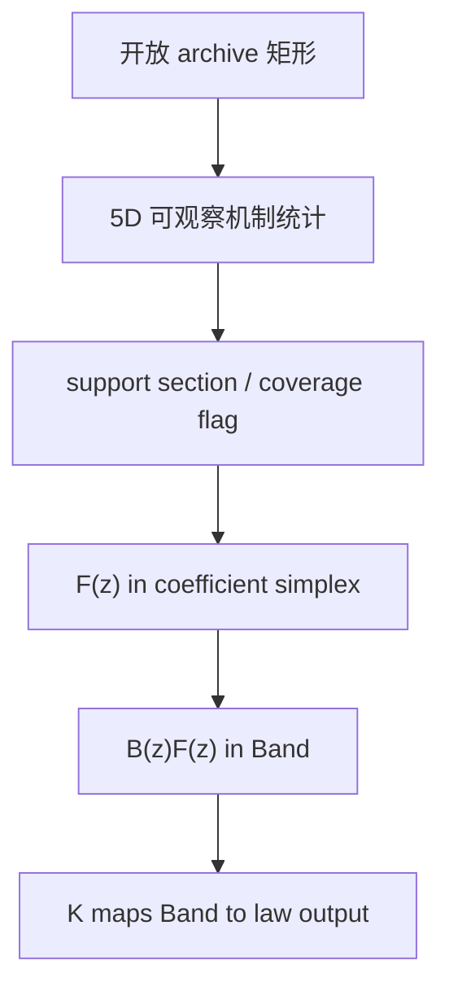

# MetaSieve 远程 VM 机制检验报告

日期：2026-08-08  
代码分支：`codex/pkis-mechanism-pilot`  
远端仓库：未修改  
结论等级：外部探索性证据，不是正式 Gate

## 结论先行

本轮没有找到一个能够合法进入冻结数学算子 `z` 的、跨开放数据集泛化的
protein-specific affinity statistic。

找到的最强候选是一个五通道 local-environment × aligned-pocket product
kernel。它修复了第一版丢失局部配体环境的问题，并在 PKIS1→PKIS2 的严格
dual-cold 主层观察到很小但统计上稳定的 interaction 增益；然而，在完全不同
测定平台的 Anastassiadis 2011 面板上，它没有显著胜过同 KLIFS group 的错配
蛋白，且 family-cold 层失败。源端通道权重还退化为几乎 100% 的通用
steric/Morgan 通道。

因此正确状态是：

\[
\boxed{\texttt{REVISION\_V2\_NOT\_VALIDATED}}
\]

而不是 `BIOLOGICAL_Z_ADMITTED`、`X1_PASS` 或
`END_TO_END_DTA_VALIDATED`。仓库的冻结算子、Band、CSMO、根状态和历史失败均
未被改写。

## 1. 我在 VM 上实际做了什么

### 1.1 以仓库为唯一状态真源

核对了 [Meta 仓库](https://github.com/1-Vast/Meta) 的根状态、L0/L0R、
X0-FEAS/X0-B、P1B、T-BASIS-R0 及模型接口。当前合法状态仍是：L0R 没有
ligand-only positive control，X1 未获授权，`model/config.py` 的 28 个 `z`
坐标仍为抽象坐标。

### 1.2 使用三个公开密集激酶面板

| 角色 | 数据 | 进入严格矩形后的规模 | 说明 |
|---|---:|---:|---|
| source | PKIS1 | 366 ligands × 175 KLIFS targets | 训练与全部模型选择 |
| consumed development | PKIS2 | 261 scaffold-cold ligands × 201 target-cold targets | v1 已使用，不能再称 sealed |
| external cross-assay | Anastassiadis 2011 | 143 scaffold-cold ligands × 63 target-cold targets | 其中 20 个 family-cold；8,678 个有限单元 |

PKIS 数据来自公开的 [Informer/PKIS 仓库](https://github.com/SpencerEricksen/informers)
和 [PKIS2 原始论文](https://doi.org/10.1371/journal.pone.0181585)。第三面板来自
[Anastassiadis 等人的原始论文与官方补充表](https://pmc.ncbi.nlm.nih.gov/articles/PMC3230241/)，
其设计为 178 个已知抑制剂 × 300 个重组激酶，在 0.5 μM 化合物、10 μM ATP
条件下测量剩余催化活性。蛋白口袋来自 [KLIFS](https://klifs.net/)，化合物
由表内 CAS 通过 [PubChem PUG REST](https://pubchem.ncbi.nlm.nih.gov/docs/pug-rest)
解析。

外部工作簿：

- SHA-256：`cd756bf2b6ad541a1781508c563caf0da6da876dfb71f2546fbff02e13d98684`
- 论文附件 MD5：`1c8e90029491e8081c826675fefec23a`
- 178 个 CAS 中 177 个精确解析，177 个均被 RDKit 读取；
- 相对 PKIS1，去除 2 个 exact-SMILES overlap 和所有 generic-Murcko-scaffold
  overlap 后保留 143 个 ligand；
- Anastassiadis 的目标变量在评分前固定为
  `clip(1 - percent_remaining_activity/100, 0, 1)`。

第三面板在冻结前只做过 schema、标识符和少量表头预览；没有做结果统计、拟合
或对比。因此它是预声明的外部检验，但不是密码学意义的完全 blind set；这一
限制保留在结果中。

## 2. 候选架构：三块、五个生物坐标

本轮只增加三个概念模块，没有改变任何冻结数学对象。

### 模块 A：Typed local-environment product kernel

配体由 RDKit 在指定中心原子上生成 radius-2 Morgan 环境；蛋白使用 85 个对齐
KLIFS 位点及公开 SiteAlign 理化表。五个跨数据集同义的通道为：

1. donor/acceptor 氢键互补；
2. 正负电荷互补；
3. 芳香堆积；
4. 疏水堆积；
5. 位阻/容纳度。

每个通道使用

\[
k_c((L,P),(L',P'))=
\operatorname{Tanimoto}(\ell_c(L),\ell_c(L'))
\exp[-d_c(P,P')/\tau_c].
\]

它要求局部配体环境与对齐口袋化学同时相似，且不使用 target、family、assay、
compound 或 dataset ID。

### 模块 B：Crossed-nuisance residual section estimator

源矩阵先消除 ligand 与 protein 主效应：

\[
R=Y-\bar Y_{L\cdot}-\bar Y_{\cdot P}+\bar Y.
\]

每个通道通过可分离 kernel ridge 拟合 `R`；正则化只在 PKIS1 内以
scaffold-cold × KLIFS-group-cold 的交叉折选择。五个 out-of-fold 预测再用

\[
w_c\ge0,\qquad \sum_c w_c\le1
\]

的凸约束组合。零向量始终可行，因此一个没有信息的通道不能靠放大系数制造
信号。

### 模块 C：Law interface 与 abstention

五个有符号贡献 \(q_c=w_cG_c\) 用源端 1%/99% 分位数平滑压缩为

\[
z_c=\tfrac12\left[1+\tanh\left(2\frac{q_c-a_c}{b_c-a_c}-1\right)\right]
\in[0,1].
\]

这只产生候选 \(z_{bio}\in[0,1]^5\)。覆盖度由最近源 ligand Tanimoto 与最近
源 pocket kernel 联合决定，低覆盖必须进入宽 law/abstention，而不是给出伪造
点值。代码没有把诊断用 raw prediction 接到 deployment 输出。

若未来正式 Gate 通过，唯一合法连接仍是：

即 \(F(z)\in\Delta_m\)、\(B(z)F(z)\in\mathrm{Band}\)、
\(A(F,z)=K(B(z)F(z))\)。正 simplex、正 ridge、Band 可行域和 law-valued
输出全部不变。

## 3. 严格对照

每个 transfer 同时比较：

- population；
- ligand-only；
- protein-only；
- additive；
- correct protein interaction；
- deranged protein interaction；
- zero interaction。

derangement 没有固定点，PKIS2 与 Anastassiadis 都有 100% 的 same-KLIFS-group
错配率。因此“wrong protein 太容易”不能解释外部失败。置信区间是 10,000 次
target-cluster bootstrap，seed 20260808。

## 4. 结果

### 4.1 第一版：全局 pharmacophore shell tensor

第一版在 PKIS2 主层失败：

- correct vs zero interaction MSE reduction：约 `-4.99e-6`；
- correct vs deranged：约 `-2.50e-5`；
- correct interaction Pearson：约 `0.0033`；
- raw correct 也没有胜过 additive、ligand-only 或 deranged。

它证明“全局药效团计数 × 每个残基位置”的线性表示不能迁移。

### 4.2 v2：local-environment product kernel

| 主层指标 | PKIS2（consumed development） | Anastassiadis（cross-assay） |
|---|---:|---:|
| ligand-only vs population MSE reduction | `5.481e-4` `[2.744e-4, 8.254e-4]` | `1.030e-3` `[5.243e-4, 1.548e-3]` |
| correct vs zero interaction MSE reduction | `1.919e-5` `[1.241e-5, 2.682e-5]` | `1.685e-5` `[8.550e-6, 2.603e-5]` |
| correct vs deranged interaction MSE reduction | `4.194e-6` `[6.996e-7, 7.925e-6]` | `2.835e-6` `[-3.172e-6, 8.237e-6]` |
| correct interaction target-macro Pearson | `0.04164` `[0.02641, 0.05667]` | `0.06413` `[0.02640, 0.10201]` |
| correct vs additive raw MSE reduction | `6.968e-6` `[-6.479e-6, 2.192e-5]` | `2.102e-5` `[1.334e-5, 2.891e-5]` |
| correct vs deranged raw MSE reduction | `8.831e-6` `[9.185e-7, 1.763e-5]` | `1.663e-6` `[-5.202e-6, 8.271e-6]` |
| registered verdict | interaction-only signal | signal not observed |

解释：

- 在 PKIS2 主层，v2 的 correct arm 同时胜过 zero 与 deranged，说明局部环境表示
  确实比 v1 好；但 family-cold 层的 correct-vs-deranged CI 仍跨零。
- 在 Anastassiadis 主层，correct 胜过 zero 且相关性 LCB>0，说明存在一个很小的
  可迁移 interaction-like signal；关键的 correct-vs-deranged CI 跨零，所以它
  不能归因于正确蛋白。
- Anastassiadis family-cold 的 correct-vs-zero、correct-vs-deranged 和 Pearson
  三项 CI 都跨零。
- location 也没有通过：外部 correct 虽胜过 additive，却没有稳定胜过 ligand-only
  与 deranged；PKIS2 上 correct 甚至明显不如 ligand-only。

效应规模同样很小。Anastassiadis 中 correct-vs-zero 的改善只约占 interaction
residual MSE 的 `0.083%`；correct-vs-deranged 约 `0.014%` 且不显著。

### 4.3 通道退化是第二个独立否决理由

PKIS1 的 dual-cold OOF 凸权重为：

| 通道 | 权重 |
|---|---:|
| H-bond | `0` |
| ionic | `0` |
| aromatic | `0` |
| hydrophobic | `≈2.0e-16` |
| steric/all-heavy-atom Morgan | `≈1.0` |

五通道 OOF 相比 zero 的 MSE 改善仅 `2.760e-6`。这说明候选在源端没有识别出
多通道机制，而是退化成通用二维结构相似性 × 口袋大小/空间相似性。即使某个
单一 transfer 指标为正，也不满足“数学与生物深度结合”的要求。

## 5. 这次实验把问题缩小到了哪里

当前可以排除两种过强解释：

1. 不能说公开密集面板没有 interaction：两个 transfer 上 correct-vs-zero 都出现
   小的正信号，v2 还显著优于 v1。
2. 不能说该信号已是正确蛋白机制：同组 derangement 基本保留了它，外部
   correct-vs-deranged 没有闭合。

最符合证据的诊断是：

\[
\boxed{
\text{当前可迁移统计量主要编码广义 ligand promiscuity / pocket susceptibility，}
\text{尚未编码 ligand-conditioned 的 protein causal contrast。}
}
\]

可分离 product kernel 只问“两个 ligand 是否相似、两个 protein 是否相似”，
它不直接学习“在两个相近蛋白之间，哪个局部残基差异导致这两个 ligand 的相对
活性发生反转”。后者才是 correct-protein-vs-deranged Gate 真正需要的量。

## 6. 下一步唯一有证据支持的路线

不能继续堆 encoder、attention、orientation 或 RFSA。下一步应先运行 X1，并把
学习对象改成 cell-disjoint rectangle 的 difference-in-differences：

\[
D_{tt';ij}
=(Y_{ti}-Y_{tj})-(Y_{t'i}-Y_{t'j}).
\]

它同时消掉 population、ligand 主效应、protein 主效应与共享 assay offset，直接
测量 protein×ligand effect modification。X0-B 已经给出可行设计，但只有真实
cluster correlation UCB 低于预设 \(\rho^*\) 时才可正式运行 X1。

如果、且仅如果 X1 PASS，下一候选应是反对称的 residue-difference ×
substructure-difference 机制坐标，而不是相似性乘积：

\[
g_c(P,P';L,L')
=\sum_{r=1}^{85}
\Delta p_{c,r}(P,P')\,\Delta \ell_{c,r}(L,L'),
\]

并强制

\[
g(P,P;L,L')=0,\quad g(P,P';L,L)=0,\quad
g(P',P;L,L')=-g(P,P';L,L').
\]

最多保留五个已声明机制坐标。它必须先在 rectangle 上通过 correct-vs-deranged、
family-cold 和跨 assay 检验，才允许构造 pair-local \(q(P,L)\)。这一步能明确
区分：interaction 不存在、interaction 存在但当前 basis 缺信息、或 basis 已足够。

## 7. 如何与底层最小极大理论真正闭合

一旦五维以内的 \(q(P,L)\) 通过 Gate，少样本适配不应再使用任意 attention，
而应显式定义 coefficient section：

\[
\mathcal A_\varepsilon(S)=
\left\{a\in\mathcal A_{archive}:\
\|Q_Sa-y_S\|_\infty\le\varepsilon\right\},
\quad (Q_S)_{ic}=q_c(P,L_i).
\]

查询值的合法 section 为

\[
\mathcal S_q=
\{q(P,L_q)^\top a:a\in\mathcal A_\varepsilon(S)\}.
\]

输出其中心与半径：

\[
\widehat y_q=\tfrac12(\inf\mathcal S_q+\sup\mathcal S_q),\qquad
r_q=\tfrac12(\sup\mathcal S_q-\inf\mathcal S_q).
\]

这里：

- `archive` 提供可行 coefficient union/envelope；
- 正确蛋白的五维机制统计提供 theory 中的 auxiliary fiber；
- \(k\le5\) support 只切割至多五个连续自由度；
- query row 不在 support row-space、矩阵秩不足或条件数过差时，半径变宽或直接
  abstain；
- CSMO/Band/K 只负责逼近这一 outer law，不凭空生成额外生物信息。

这才是底层 trace-modulus/section 理论与生物信息学的深结合：生物统计决定可行
section，数学算子输出该 section 的 law 与证书。当前缺的不是接口，而是已经通过
correct-protein Gate 的 \(q\)。

## 8. 可复现性与状态处理

- v1 预注册、代码、负结果和 manifest 均保留；
- v2 在评分前保存了预注册与代码 SHA-256 冻结文件；
- 新增纯函数测试共 10 个，全部通过；
- PKIS2 与 Anastassiadis 的 derangement 均为 0 fixed point、100% same group；
- `model/`、`project_state.json`、CSMO、Band、positive ridge、DAVIS 和 ChEMBL X1
  labels 均未触碰；
- 远端 GitHub 未提交、未推送、未创建 PR。

最终科学结论不是“模型问题已经解决”，而是：v1 的局部环境缺失得到部分修复，
但外部 correct-protein 因果特异性仍未识别；继续合法推进的前置条件是 X1 与
rectangle-contrast basis，而不是继续扩大现有模型。
